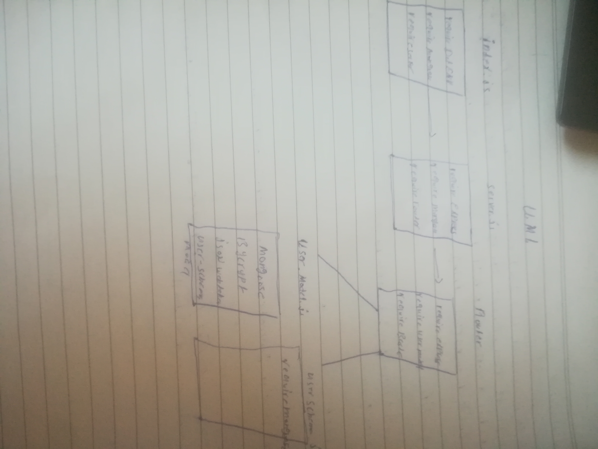

# LAB - Class 12

## Project: lab-12

### Author: Alaa almasri

### Links and Resources

- [submission PR](https://github.com/alaaalmasri12/auth-server/pull/2)

### Setup

#### `.env` requirements (where applicable)

i.e.

- `PORT` - 3000
- `MONGODB_URI` - MONGODB_URI = 'mongodb://localhost:27017/lab-11-db';

#### How to initialize/run your application (where applicable)

- e.g. `nodemon`

#### UML

